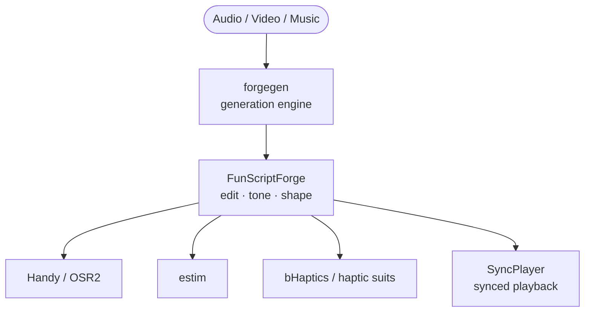
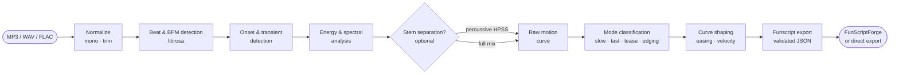
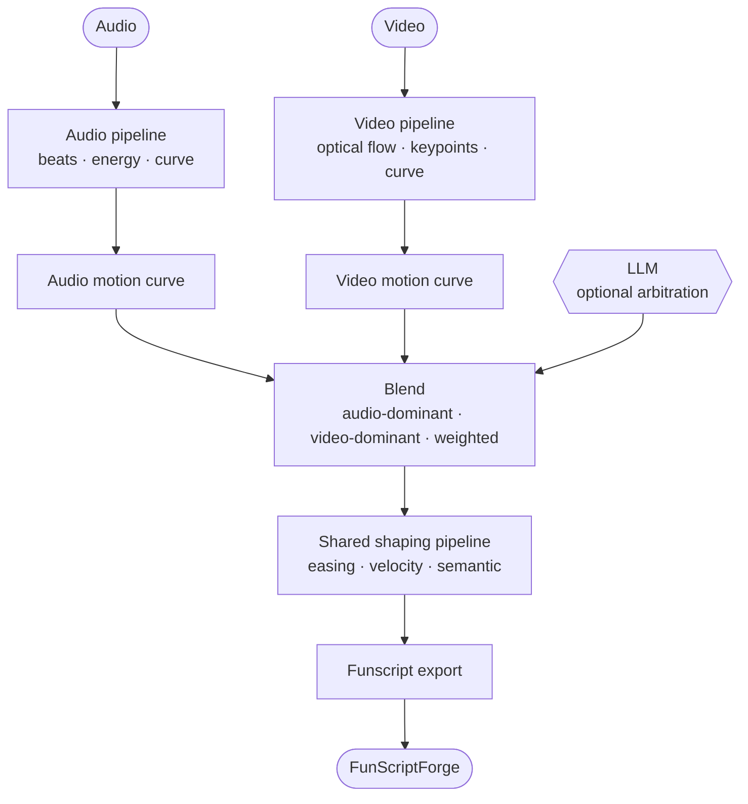

# forgegen — Architecture

forgegen is a **haptic content generation engine**. It converts audio, video, or both into
funscripts that drive any haptic device. It does not edit funscripts — that is FunScriptForge's job.

---

## Product stack



forgegen never requires an existing funscript.
FunScriptForge never generates from scratch.
They are independent tools with a clean handoff.

---

## Three input paths

### Path 1 — Audio only (the 30-second demo)

Pure DSP. No video. No LLM required. Fast. **This path is complete as of v0.1.**



**What's built:** beat detection, BPM, onsets, energy, HPSS percussive separation (`analyze_beats()` in videoflow); raw motion curve, mode classification, curve shaping, funscript JSON export (`videoflow.generate`); Streamlit UI (`forgegen/app.py`, `panels/generate.py`, `panels/details.py`).
**What remains on this path:** estim audio → funscript; preview/playback during generation.

---

### Path 2 — Video only

Multi-stage GPU-accelerated pipeline.

```mermaid
flowchart LR
    VID([Video file]) --> V1[Ingest & preprocess\nFFmpeg · PyAV · OpenCV]
    V1 --> V2[Motion detection\nRAFT optical flow\nMoveNet keypoints]
    V2 --> V3[Signal cleanup\nsmoothing · outliers\nvelocity limiting]
    V3 --> V4[Amplitude normalization\n0–100 range]
    V4 --> V5[Stroke segmentation]
    V5 --> V6[Pattern & rhythm\ndetection]
    V6 --> V7[Mode classification\nslow · fast · tease\nedging · chaotic · break]
    V7 --> V8[Curve shaping\neasing · velocity\nsemantic envelopes]
    V8 --> V9[Funscript export\nvalidated JSON]
    V9 --> FSF([FunScriptForge\nor direct export])
```



**What's already built:** frame extraction, probe, extract_audio (media-tools).
**What remains:** RAFT optical flow, MoveNet keypoints, all signal processing stages, funscript export.

---

### Path 3 — Audio + Video hybrid

Both pipelines run in parallel. A blending layer (user-controlled or LLM-assisted) decides
which modality dominates each segment of the timeline.



---

## Shaping pipeline (shared by all paths)

```mermaid
flowchart LR
    RAW[Raw motion curve] --> S1[Curve shaping\nper-mode easing]
    S1 --> S2[Micro-easing refinement\nlocal polynomial smoothing]
    S2 --> S3[Interpolation & resampling\ntarget rate · drift correction]
    S3 --> S4[Easing & velocity shaping\nmode-specific profiles]
    S4 --> S5[Semantic shaping\ntease oscillations\nedging ramps · cooldown]
    S5 --> S6[Velocity enforcement\nclamp or subdivide]
    S6 --> S7[JSON structuring\nfunscript format]
    S7 --> S8[Validation\njsonschema · velocity check]
```



---

## LLM layer

LLMs are optional and touch only semantic and creative decisions. All DSP is deterministic.

| Stage | LLM role |
| --- | --- |
| Mood & structure | Interprets segment as slow / tease / build / drop / ambient |
| Mode refinement | Suggests tease, edging, chaotic, break for each section |
| User intent | Translates "make the drop hit harder" → parameter set |
| Hybrid arbitration | Decides audio vs. video dominance per segment |
| Semantic shaping | Adjusts envelopes based on emotional arc |

Privacy note: for adult content, LLM calls must run locally (Ollama) — cloud APIs are not appropriate.

---

## ML-trained models (optional, V2+)

Three models learn the "creative fingerprint" from 50+ hand-crafted expert scripts:

| Model | What it learns |
| --- | --- |
| Behavior segmentation | Slow / fast / tease / edging / chaotic labels from embeddings |
| Curve shaping | Human smoothing, easing, tension, stroke timing |
| Semantic intent | Emotional tone, narrative arc, user-intent mapping |

Training data: expert funscripts + labeled mode timelines. No model is required for V1.

---

## Key design principles

- **Python owns deterministic DSP** — beat detection, FFTs, optical flow, keypoints, clustering, curve math
- **PyTorch owns GPU acceleration** — all tensor ops, convolution, batching; CPU fallback always available
- **LLMs own semantics** — mood, intent, creative decisions only
- **User hides from complexity** — sliders map to deep internal pipelines; "Follow drums" → parameter set
- **Modular stages** — every step is independent, testable, and replaceable
- **Output agnostic** — one funscript handed to FunScriptForge for device-specific export
- **Local-first** — no cloud dependency for core pipeline; LLM optional; GPU optional (slower on CPU)

---

## Library stack

```
forgegen
  └── videoflow          orchestration (reel, canvas, audio analysis)
        └── media-tools  low-level file ops (probe, clip, extract, concat)
              └── FFmpeg / librosa / OpenCV / PyTorch
```

---

## Task list

### Completed ✅

| Task | Location |
| --- | --- |
| Beat & BPM detection | `videoflow.audio.analyze_beats()` |
| Onset & energy analysis | `analyze_beats()` — energy field |
| HPSS percussive source separation | `analyze_beats(source="percussive")` |
| Beat snap, beat range queries | `AudioBeatMap.nearest_beat()`, `beats_in_range()` |
| AudioBeatMap save / load | `beat_map.save()`, `AudioBeatMap.load()` |
| Audio mix (levels, fades, ramps) | `videoflow.mix.AudioMix` |
| Frame extraction | `media-tools extract_frames` |
| Audio extraction | `media-tools extract_audio` |
| Video probe / metadata | `media-tools probe` |
| Clip / trim | `media-tools clip` |
| Concat with gaps + chapters | `videoflow.reel.Reel` |
| Multi-panel canvas | `videoflow.layout.MultiPanelCanvas` |

### Completed — Audio path ✅

| Task | Location |
| --- | --- |
| Raw motion curve from beats/energy | `videoflow.generate.beats_to_curve()` |
| Audio mode classification | `videoflow.generate.classify_modes()` |
| Curve shaping — audio | `videoflow.generate.shape_curve()` |
| Funscript JSON export | `videoflow.generate.export_funscript()` |
| Convenience pipeline wrapper | `videoflow.generate.generate_from_beats()` |
| CLI command | `videoflow generate-funscript` |
| Streamlit UI — Generate tab | `forgegen/panels/generate.py` |
| Streamlit UI — Details tab | `forgegen/panels/details.py` |
| Style presets (Rhythmic / Sensual / Intense / Chaotic) | `forgegen/panels/generate.py` |
| Energy heatmap + funscript curve preview | plotly, both panels |

### Remaining — Audio path 🔲

| Task | Notes |
| --- | --- |
| Estim audio → funscript | Peak-based and stereostim A/B paths |
| Preview / playback | Media + funscript curve synchronized during generation |

### Remaining — Video path 🔲

| Task | Notes |
| --- | --- |
| Video ingest pipeline | FFmpeg/PyAV frame extraction, stabilization (vidstab) |
| ROI detection | MediaPipe (CPU) or YOLOv8 (GPU) |
| Dense optical flow | RAFT (GPU) or OpenCV Farnebäck (CPU fallback) |
| Keypoint tracking | MoveNet Lightning (CPU-friendly) |
| Signal cleanup | Smoothing, outlier removal, velocity limiting |
| Amplitude normalization | Scale motion to 0–100 |
| Stroke segmentation | Peak/trough detection → stroke units |
| Pattern smoothing & rhythm enforcement | Align strokes to beat grid |
| Rhythm detection | FFT + autocorrelation |
| Pattern clustering | KMeans / DBSCAN on stroke features |
| Mode classification (deterministic) | Rule-based: slow/fast/tease/edging/chaotic/break |
| Mode transitions | Section boundaries, structural timeline |
| Tempo-change detection | Accel / decel / drift / stable segments |
| Curve shaping — video | Per-mode easing, velocity profiles |
| Micro-easing refinement | Local polynomial smoothing |
| Interpolation & resampling | Target rate, drift correction |
| Semantic shaping — video | Edging ramps, tease oscillations, cooldown |
| Funscript JSON export | Same as audio path |
| VR / 360 video support | Not yet specced — see ROADMAP.md |

### Remaining — Hybrid path 🔲

| Task | Notes |
| --- | --- |
| Blending layer | Weighted merge of audio + video curves |
| Per-segment dominance | User slider + LLM arbitration |
| Timeline UI | Three stacked bands: audio / video / semantic |

### Remaining — LLM layer 🔲

| Task | Notes |
| --- | --- |
| Semantic audio interpretation | Mood, structure, emotional arc |
| User intent translation | Natural language → parameter set |
| Hybrid arbitration | Audio vs. video dominance per segment |
| Local LLM integration | Ollama (required for adult content) |

### Remaining — ML models (V2+) 🔲

| Task | Notes |
| --- | --- |
| Behavior segmentation model | BiLSTM / Transformer; needs 500–2000 labeled clips |
| Curve shaping model | Supervised regression from expert scripts |
| Semantic intent model | Multi-label classification |
| Labeling workflow | Tool for annotating mode timelines on expert scripts |

### Remaining — UI 🔲

| Task | Notes |
| --- | --- |
| Easy Button tab | File drop → generate → preview → export |
| Audio-only UI | Waveform + BPM display + style cards + real-time funscript preview |
| Video UI | Motion heatmap + controls |
| Hybrid timeline UI | Three-band heatmap, segment slicer, dominance selector |
| Preview playback | Media + funscript curve synchronized |

### Remaining — Haptics expansion 🔲

| Task | Notes |
| --- | --- |
| bHaptics body-region tagging | Multi-channel spatial tagging schema |
| Haptics preset system | Style → spatial activation patterns |
| Multi-device export | Beyond single-axis funscript |

### Remaining — Infrastructure 🔲

| Task | Notes |
| --- | --- |
| FunScriptForge handoff spec | File protocol? API? "Open in FSF" button? |
| Windows installer | How users install and run forgegen |
| GPU / CPU fallback strategy | Graceful degradation when no CUDA available |
| Test strategy | Ground truth for generated funscripts |
| Privacy model decision | Local LLM (Ollama) vs. cloud — especially for adult content |

---

## Open issues for discussion

1. **Privacy / LLM model** — The spec uses GPT-4-class LLMs. Adult content cannot go to OpenAI/Anthropic APIs. Decision needed: local Ollama only, or tiered (local default, cloud opt-in for SFW use cases)?

2. **GPU requirement** — Video path (RAFT optical flow) needs a GPU for reasonable speed. What is the CPU fallback story? Is the video path CPU-viable at all, or do we require GPU for video and CPU-only for audio?

3. **VR / 360 video** — FunGen specifically targets POV VR video. forgegen doesn't address this. Is VR support required to replace FunGen, or is it out of scope for V1?

4. **Content-specific ROI** — YOLO/MediaPipe are general-purpose. Adult content requires specialized detection to find the relevant region of interest. This is a real technical gap — what model do we use?

5. **FunScriptForge handoff** — "Open in FunScriptForge" is mentioned but not specced. File drop? Shared folder? API call? This needs a decision before we build the UI.

6. **Estim path placement** — Estim audio → funscript is specced in `estim_audio_input/notes.md` but doesn't appear in the main pipeline diagram. Is it a first-class input path alongside audio/video, or a post-processing step?

7. **Training data for ML models** — The three ML models need 500–2000 labeled expert scripts. Who labels them? Is there a community of expert scripters who would contribute? This determines whether V2 ML models are realistic.

8. **The "easy button" scope** — How much should V1 expose? Full controls or just style cards + generate? Too many options will kill the 30-second demo experience.

9. **Distribution** — Desktop app (Electron/Tauri)? Python package + Streamlit UI? Windows installer only? Web app? Decision shapes the entire UI architecture.

10. **Relationship to FunscriptFlow / FunGen** — Both are open source (Apache). Do we fork, wrap, or build independently? Wrapping FunscriptFlow for V1 could dramatically accelerate the timeline.
